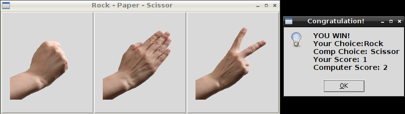

# Rock-Paper-Scissors-Game in Python3 

## What's this game ?

Rock-paper-scissors (also known as paper, scissors, stone or other variants) is a hand game usually played between two people, in which each player simultaneously forms one of three shapes with an outstretched hand. These shapes are "rock" (a closed fist), "paper" (a flat hand), and "scissors" (a fist with the index and middle fingers extended, forming a V). "Scissors" is identical to the two-fingered V sign (aka "victory" or "peace sign") except that it is pointed horizontally instead of being held upright in the air. A simultaneous, zero-sum game, it has only two possible outcomes other than a tie: one of the two players wins, and the other player loses.

A player who decides to play rock will beat another player who has chosen scissors ("rock crushes scissors" or sometimes "blunts scissors"), but will lose to one who has played paper ("paper covers rock"); a play of paper will lose to a play of scissors ("scissors cut paper"). If both players choose the same shape, the game is tied and is usually immediately replayed to break the tie. Originating from China and Japan, other names for the game in the English-speaking world include roshambo and other orderings of the three items, with "rock" sometimes being called "stone".

Rock-paper-scissors is often used as a relatively fair choosing method between two people, similar to coin flipping, drawing straws, or throwing dice in order to settle a dispute or make an unbiased group decision.

Unlike truly random selection methods, however, rock–paper–scissors can be played with a degree of skill by recognizing and exploiting non-random behavior in opponents.  





## Rules of the game :

The players usually count aloud to 3, or speak the name of the game (e.g. "Rock! Paper! Scissors!"), each time either raising one hand in a fist and swinging it down on the count or holding it behind. They then "throw" by extending it towards their opponent. Variations include a version where players use only three counts before throwing their gesture (thus throwing on the count of "Scissors!"), or a version where they shake their hands three times before "throwing".


## What you need to make it work :

Install all the packages for : Python 3.

Pillow (for Image)
```sh
pip install Pillow
```

```sh
sudo apt-get install python3-pil
```

```sh
export PYTHONPATH=/usr/local/lib/python3.6/dist-packages:/usr/local/lib/python3.6/site-packages
```

ImageTk
```sh
sudo apt-get install python-pil.imagetk
```

python3-tk (tkinter)
```sh
sudo apt-get install python3-tk
```  


## How to launch the game :

```sh
python3 RockPaperScissors.py
```


## Developer - Author

Hamdy Abou El Anein

